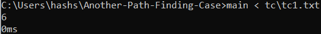
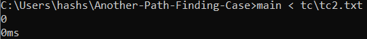
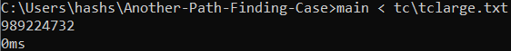
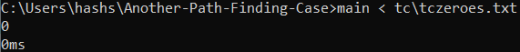

# Dynamic Programming : Another Path Finding Case

## Latar Belakang
*Path Finding* adalah masalah yang berfokus untuk mencari langkah paling optimum untuk bergerak dari posisi asal ke posisi akhir dengan batasan-batasan (*constraints*) tertentu. Masalah ini dapat diselesaikan dengan mudah menggunakan pendekatan strategi algoritma *dynamic programming* seperti pada contoh berikut oleh  [GeeksForGeeks](https://www.geeksforgeeks.org/min-cost-path-dp-6/). Banyak penerapan yang memiliki fokus berbeda terkait topik *Path Finding* seperti pada robot, game, image processing serta pengelolahan efisien industri. Semua kasus ini berkutat dalam mengoptimasi dari sisi paling pendek, paling murah, paling cepat dan parameter lainnya. 

## Kasus Path Finding
Berikut adalah deskripsi kondisi persoalan yang akan diselesaikan.
1. Terdapat sebuah papan catur *N x N* dengan setiap kotaknya berisi bilangan non negatif.
2. Di awal, suatu bidak berada kotak (1, 1) atau yang di pojok kiri atas.
3. Berikutnya secara berulang bidak dapat dipindahkan (1) horizontal ke kanan, atau (2) vertikal ke bawah sekian kotak sebanyak dengan bilangan pada kotak terakhir bidak itu berada, kecuali kalau membawa bidak keluar dari papan.
4. Tujuan akhir adalah kotak (N, N) atau yang pojok kanan bawah.
5. Bila bilangan terakhir adalah 0 dan bukan di pojok maka bidak berhenti (tidak dapat melanjutkan langkah kecuali kalau sudah mencapai tujuan).

## Spesifikasi
Dengan bahasa pemrograman **_C++_**, terdapat sebuah fungsi dalam program berbasis CLI yang dapat menyelesaikan persoalan cerita diatas yang menghitung:
1. Banyaknya cara yang mungkin untuk bisa mencapai tujuan akhir sebagai kembalian dari fungsi.
2. Waktu yang digunakan untuk mencari semua solusi (_dicari pada main function_).

Deklarasi fungsi:
```C++
int pathFinding(PapanCatur* p);
```
Dengan `PapanCatur` adalah _user-defined class_ yang berperan sebagai matriks dengan menyimpan nilai ukuran matriks tersebut (_size_ = panjang matriks = lebar matriks).

## Strategi Algoritma
Secara definisi, banyaknya cara menuju titik _(x, y)_ dari _(1, 1)_ pada papan catur adalah jumlah dari banyaknya cara untuk menuju titik _(i, j)_ dari _(1, 1)_ untuk seluruh pasangan _(i, j)_ yang dapat menuju _(x, y)_ melalui satu kali pemindahan bidak. Dan secara definisi juga, banyaknya cara menuju titik _(1, 1)_ adalah 1 cara (yakni secara trivial bahwa titik mulai yang menjadi titik tujuan hanya terdapat 1 cara, yaitu dengan memulai). Maka, kedua definisi di atas dapat diformulasikan menjadi kasus-kasus _recursive behavior_:

### Base-case


Secara trivial bahwa hanya ada satu cara menunju titik mulai.

### Recursive-case


Untuk seluruh _(i, j)_ yang dapat menuju _(x, y)_ dalam satu kali pemindahan bidak.

Menggunakan strategi _bottom-up dynamic programming_ dan memahami bahwa setiap pemindahan bidak hanya dapat dilakukan ke arah kanan dan/atau bawah saja, maka penghitungan kasus rekursif dapat dilakukan dengan mengiterasi nilai _dp(i, j)_ untuk menambahkannya kepada petak-petak yang dapat dilewati oleh _(i, j)_ dengan satu kali pemindahan bidak di mana nilai j terus bertambah dan jika j sudah mencapai ujung papan catur, menambah nilai i. Dengan demikian, setiap iterasi _dp(i, j)_ yang sudah dilewati tidak akan berubah nilainya dan petak-petak selanjutnya tidak akan membutuhkan nilai itu lagi.

## Mengompilasi dan Menjalankan Program
Untuk mengompilasi program, pastikan `g++` sudah ter-_install_ pada sistem operasi. Sebagai referensi, penulis menggunakan **_g++ (MinGW.org GCC-6.3.0-1) 6.3.0_** dengan sistem operasi **_Windows 10 Home 64-bit_** untuk mengompilasi kode sumber program pada repositori ini. Sintaks yang digunakan melalui _command-line_ adalah
```cmd
Another-Path-Finding-Case> g++ main.cpp -o main
```

Untuk menjalankan program (yang sudah terkompilasi dengan nama `main`), jalankan
```cmd
Another-Path-Finding-Case> main
```
Pastikan bahwa setelah memberikan masukan yaitu matriks, tekan **CTRL + D** agar _eof_ dipaksakan kepada program.

Untuk menjalankan program dengan masukan dari berkas eksternal (sebagai contoh, dari `tc\tc1.txt`), jalankan
```cmd
Another-Path-Finding-Case> main < tc\tc1.txt
```

## Pengujian Kasus Uji
### Kasus Uji 1 
**Input**:
```
2 3 3 1
1 2 1 3
1 2 3 1
3 1 1 0
```
**Output**:



### Contoh Kasus Uji 2
**Input**:
```
2 3 0 1 3 1
1 0 1 3 1 3
0 2 3 1 3 1
3 1 1 0 1 0
1 2 1 3 1 3
3 1 1 0 1 0
```
**Output**:



### Contoh Kasus Uji Besar
**Input**: Papan catur berukuran 25x25 dengan seluruh elemen berisi 1

**Output**:



### Contoh Kasus Uji Lebih Besar
**Input**: Papan catur berukuran 50x50 dengan seluruh elemen berisi 0

**Output**:



## Appendiks
Dalam mengembangkan program dan menjalankan kasus uji, penulis menggunakan komputer dengan spesifikasi sistem:
* **Operating System**: Windows 10 Home Single Language 64-bit (10.0, Build 17763) (17763.rs5_release.180914-1434)
* **Manufacturer / Model**: Dell Inc. / Inspiron 7472
* **Processor**: Intel(R) Core(TM) i7-8550U CPU @ 1.80GHz (8 CPUs), ~2.0GHz
* **Memory**: 16384MB RAM
