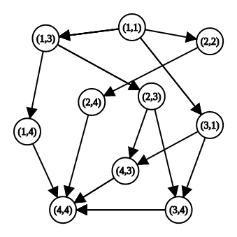
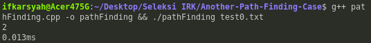
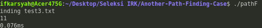
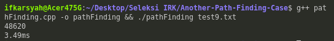

# Dynamic Programming : Another Path Finding Case

## Latar Belakang

_Path Finding_ adalah masalah yang berfokus untuk mencari langkah paling optimum untuk bergerak dari posisi asal ke posisi akhir dengan batasan-batasan (_constraints_) tertentu. Masalah ini dapat diselesaikan dengan mudah menggunakan pendekatan strategi algoritma _dynamic programming_ seperti pada contoh berikut oleh [GeeksForGeeks](https://www.geeksforgeeks.org/min-cost-path-dp-6/). Banyak penerapan yang memiliki fokus berbeda terkait topik _Path Finding_ seperti pada robot, game, image processing serta pengelolahan efisien industri. Semua kasus ini berkutat dalam mengoptimasi dari sisi paling pendek, paling murah, paling cepat dan parameter lainnya.

## Deskripsi Persoalan

Berikut adalah deskripsi kondisi persoalan yang akan diselesaikan.

1. Terdapat sebuah papan catur _N x N_ dengan setiap kotaknya berisi bilangan non negatif.
2. Di awal, suatu bidak berada kotak (1, 1) atau yang di pojok kiri atas.
3. Berikutnya secara berulang bidak dapat dipindahkan (1) horizontal ke kanan, atau (2) vertikal ke bawah sekian kotak sebanyak dengan bilangan pada kotak terakhir bidak itu berada, kecuali kalau membawa bidak keluar dari papan.
4. Tujuan akhir adalah kotak (N, N) atau yang pojok kanan bawah.
5. Bila bilangan terakhir adalah 0 dan bukan di pojok maka bidak berhenti (tidak dapat melanjutkan langkah kecuali kalau sudah mencapai tujuan).

## Spesifikasi

Program **_C++_** berbasis CLI yang dapat menyelesaikan persoalan di atas yang menghitung :

1. Banyaknya cara yang mungkin untuk bisa mencapai tujuan akhir.
2. Waktu yang digunakan untuk mencari semua solusi.

Deklarasi fungsi :

```C++
int pathFinding(papanCatur);
```

Fungsi menampilkan jumlah kemungkinan dan waktu ke layar serta melakukan pengembalian jumlah kemungkinan tersebut.

## Contoh Kasus Uji

### Contoh Kasus Uji 1

Input :

```
2 3 3 1
1 2 1 3
1 2 3 1
3 1 1 0
```

Output :

```
6
20ms
```

Penjelasan :
jalur yang mungkin adalah

1. [1][1] -> [2][2] -> [2][4] -> [4][4]
2. [1][1] -> [3][1] -> [4][3] -> [4][4]
3. [1][1] -> [3][1] -> [3][4] -> [4][4]
4. [1][1] -> [1][3] -> [1][4] -> [4][4]
5. [1][1] -> [1][3] -> [2][3] -> [3][4] -> [4][4]
6. [1][1] -> [1][3] -> [2][3] -> [4][3] -> [4][4]

### Contoh Kasus Uji 2

Input:

```
2 3 0 1 3 1
1 0 1 3 1 3
0 2 3 1 3 1
3 1 1 0 1 0
1 2 1 3 1 3
3 1 1 0 1 0
```

Output :

```
0
1ms
```

## Ide Penyelesaian

Kita menggunakaan contoh input 1 sebagai bantuan penjelasan:

Mulai dari pojok kiri-atas atau baris 1, kolom 1(kita sebut titik (1,1)),
kita akan membentuk sebuah pohon dengan (1,1) sebagai akarnya.
Pohon yang di bentuk, akan terlihat seperti gambar di bawah.



Cara membaca graf di atas adalah sebagai berikut:

- Titik (1,1) bernilai 2, dan bisa bergerak ke kanan atau ke bawah sebanyak 2 langkah. Titik yang dapat dicapai dari (1,1) adalah (1,3), (2,2), dan (3,1).
- Titik (2,2) bernilai 1, dan bisa bergerak ke (2,4) atau (4,3).

Algoritma:

- Mula-mula kita menyiapkan matriks _waysTo[][]_, dengan waysTo[r][c] adalah banyaknya cara menuju titik (i,j) dari (1,1).
- Kita akan mengisi matriks _waysTo[][]_ secara bottom-up. Jadi, mulai dari (1,1) kita akan **menambah** isi matriks _waysTo[][]_ untuk setiap titik yang dapat dilalui dari (1,1) jalan 2 kotak, yaitu titik (1,3), (2,2), dan (3,1) dengan 1.
- Kita akan melakukan langkah ini secara rekursif untuk tiap anak dari (1,1).
- Hasil yang kita cari akan terdapat di _waysTo[N][n]_

Jika, dirumuskan, setiap isi dari waysTo[][] di isi dengan aturan berikut:
$$waysTo(r,c) = 1 \text{, untuk (i,j) yang dapat mencapai (r,c) dan (r,c)=(1,1)}$$
$$waysTo(r,c) = \sum_{i,j}^{} waysTo(i, j) \text{, untuk (i,j) yang dapat mencapai (r,c) lainnya}$$

## Cara Kompilasi Program

```
g++ pathFinding.cpp -o pathFinding
```

## Cara Menjalankan Program

Di directory yang sama, terdapat beberapa file berisi contoh kasus dengan format **test[x].txt**. Misal, untuk menjalankan test case 1, masukkan perintah berikut:

```
./pathFinding test1.txt
```

## Contoh kasus yang diujikan

Test Case 0:

```
2 1 2
3 1 1
1 2 0
```



Test Case 3:

```
2 1 2
3 1 1
1 2 0
```



Test Case 9:

```
1 1 1 1 1 1 1 1 1 1
1 1 1 1 1 1 1 1 1 1
1 1 1 1 1 1 1 1 1 1
1 1 1 1 1 1 1 1 1 1
1 1 1 1 1 1 1 1 1 1
1 1 1 1 1 1 1 1 1 1
1 1 1 1 1 1 1 1 1 1
1 1 1 1 1 1 1 1 1 1
1 1 1 1 1 1 1 1 1 1
1 1 1 1 1 1 1 1 1 1
```


