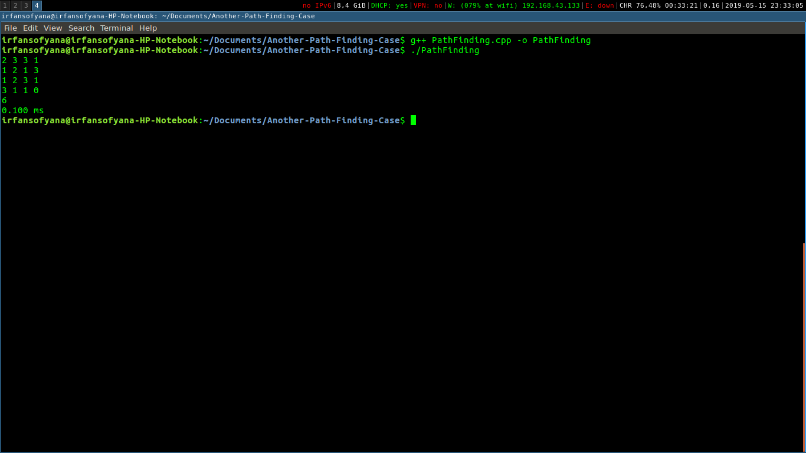
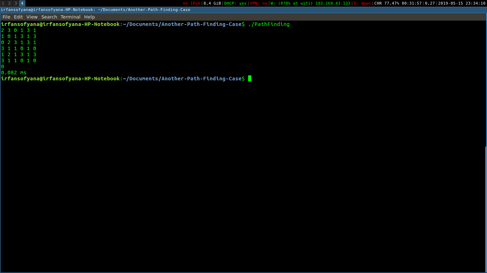
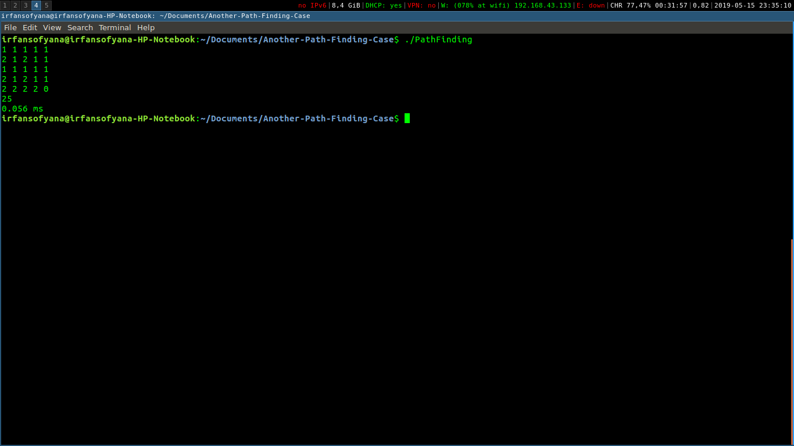

# Dynamic Programming : Another Path Finding Case

## Latar Belakang
*Path Finding* adalah masalah yang berfokus untuk mencari langkah paling optimum untuk bergerak dari posisi asal ke posisi akhir dengan batasan-batasan (*constraints*) tertentu. Masalah ini dapat diselesaikan dengan mudah menggunakan pendekatan strategi algoritma *dynamic programming* seperti pada contoh berikut oleh  [GeeksForGeeks](https://www.geeksforgeeks.org/min-cost-path-dp-6/). Banyak penerapan yang memiliki fokus berbeda terkait topik *Path Finding* seperti pada robot, game, image processing serta pengelolahan efisien industri. Semua kasus ini berkutat dalam mengoptimasi dari sisi paling pendek, paling murah, paling cepat dan parameter lainnya. 

Pada tugas kali ini, anda akan bertugas untuk memodifikasi algoritma *path finding* agar sesuai dengan kebutuhan soal. Diharapkan melalui tugas ini, anda dapat lebih memahami penerapan strategi *dynamic programming* yang sering digunakan dalam dunia IT terkhusus filosofi cara berpikir penyelesaian masalah terkait *path finding*. Selamat mengerjakan!

## Kasus Path Finding
Berikut adalah deskripsi kondisi persoalan yang akan diselesaikan.
1. Terdapat sebuah papan catur *N x N* dengan setiap kotaknya berisi bilangan non negatif.
2. Di awal, suatu bidak berada kotak (1, 1) atau yang di pojok kiri atas.
3. Berikutnya secara berulang bidak dapat dipindahkan (1) horizontal ke kanan, atau (2) vertikal ke bawah sekian kotak sebanyak dengan bilangan pada kotak terakhir bidak itu berada, kecuali kalau membawa bidak keluar dari papan.
4. Tujuan akhir adalah kotak (N, N) atau yang pojok kanan bawah.
5. Bila bilangan terakhir adalah 0 dan bukan di pojok maka bidak berhenti (tidak dapat melanjutkan langkah kecuali kalau sudah mencapai tujuan).
1
## Spesifikasi
Lakukan fork terhadap repository ini.

Buatlah dalam bahasa pemrograman **_Python_** atau **_C++_**, sebuah fungsi dalam program berbasis CLI yang dapat menyelesaikan persoalan cerita diatas yang menghitung :
1. Banyaknya cara yang mungkin untuk bisa mencapai tujuan akhir.
2. Waktu yang digunakan untuk mencari semua solusi.

Deklarasi fungsi :
```C++
int pathFinding(papanCatur);
```
Fungsi menampilkan jumlah kemungkinan dan waktu ke layar serta melakukan pengembalian jumlah kemungkinan tersebut.

## Strategi Penyelesaian dengan Dynamic Programming (DP)
Persoalan ini dapat diselesaikan dengan menggunakan dynamic programming. State persoalan ini adalah indeks baris dan kolom yang ada pada papan catur. Kita lalu bisa mendefinisikan ways[i][j] sebagai banyaknya jalan dari kotak (1, 1) menuju kotak (i, j) dengan aturan yang sudah dijelaskan sebelumnya di atas. 

Untuk mengimplementasikan dynamic programming ini, kita dapat melakukannya dengan teknik bottom-up, yaitu melakukan perhitungan berdasarkan kasus kecil yang kecil (base case) menuju kasus yang lebih besar. Adapun base case dan relasi antar fungsi yang digunakan adalah sebagai berikut

### Base case
<a href="https://www.codecogs.com/eqnedit.php?latex=ways[1][1]&space;=&space;1" target="_blank"></a>

Obvious, banyak jalan dari kotak (1, 1) ke (1, 1) adalah 1 cara.

### Recurrence
<a href="https://www.codecogs.com/eqnedit.php?latex=ways[i][j]&space;=&space;\sum_{x,&space;y}ways[x][y]" target="_blank"></a>

Dimana (x, y) adalah suatu kotak yang ada papan catur yang memiliki total perpindahan menuju kotak (i, j) (secara vertikal dan horizontal) sebesar nilai pada kotak(x, y) i.e (terdapat suatu bilangan bulat non-negatif k, dimana x+k = i dan y+kotak[x][y]-k = j dengan kotak[x][y] adalah bilangan yang ada pada kotak (x, y))

Proses implementasi dengan bottom-up akan dilakukan dengan iterasi tiap kotak yang ada pada papan catur, lalu melakukan update nilai ways[i][j] sesuai dengan nilai pada tabel ways[][] yang sudah didapat sebelumnya.

## Cara Menjalankan
Untuk menjalankan program ini, pastikan terdapat compiler `g++` yang sudah terpasang. 

Untuk melakukan kompilasi pada program, kita dapat melakukannya melalui terminal dengan cara:
```cmd
g++ PathFinding.cpp -o PathFinding
```

Setelah proses kompilasi, untuk menjalankan program ini kita dapat melakukannya dengan cara:
```cmd
PathFinding
```
Pada sistem operasi windows.

atau
```cmd
./PathFinding
```
pada sistem operasi linux.

Perlu diperhatikan bahwa dengan cara seperti ini, masukan untuk program akan berhenti ketika pengguna menekan **CTRL + D**. Oleh karena itu, pastikan input harus **valid**.

Untuk menjalankan program dengan input menggunakan file eksternal (contoh file: tc-1.in), dapat dilakukan dengan cara:

```cmd
PathFinding < tc-1.in
```
pada sistem operasi windows.

atau
```cmd
./PathFinding < tc-1.in
```
pada sistem operasi linux

## Spesifikasi Mesin
Dalam melakukan pembuatan, pengembangan dan pengujian program, spesifikasi mesin yang digunakan adalah sebagai berikut:

* System Manufacture	: Hewlett-Packard
* System Model		: HP Notebook
* Processor		: Intel(R) Core(TM)i5-5200U CPU @ 2.20GHz (4 CPus), ~2.2GHz
* Operating System	: Ubuntu 16.04
* Memory		: 4096 GB RAM

## Pengujian
### Kasus Uji 1 
Input :
```
2 3 3 1
1 2 1 3
1 2 3 1
3 1 1 0
```
Output :
```
6
20 ms
```
Screenshot:

 <br />

### Kasus Uji 2
Input:
```
2 3 0 1 3 1
1 0 1 3 1 3
0 2 3 1 3 1
3 1 1 0 1 0
1 2 1 3 1 3
3 1 1 0 1 0
```
Output :
```
0
1 ms
```
Screenshot:

 <br />

## Kasus Uji 3
Input:
```
1 1 1 1 1
2 1 2 1 1
1 1 1 1 1
2 1 2 1 1
2 2 2 2 0
```
Output:
```
25
0.056 ms
```
Screenshot:

 <br />

