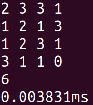
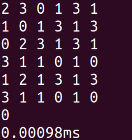
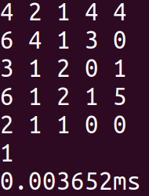

# Dynamic Programming : Another Path Finding Case

## Latar Belakang
*Path Finding* adalah masalah yang berfokus untuk mencari langkah paling optimum untuk bergerak dari posisi asal ke posisi akhir dengan batasan-batasan (*constraints*) tertentu. Masalah ini dapat diselesaikan dengan mudah menggunakan pendekatan strategi algoritma *dynamic programming* seperti pada contoh berikut oleh  [GeeksForGeeks](https://www.geeksforgeeks.org/min-cost-path-dp-6/). Banyak penerapan yang memiliki fokus berbeda terkait topik *Path Finding* seperti pada robot, game, image processing serta pengelolahan efisien industri. Semua kasus ini berkutat dalam mengoptimasi dari sisi paling pendek, paling murah, paling cepat dan parameter lainnya. 

Pada tugas kali ini, anda akan bertugas untuk memodifikasi algoritma *path finding* agar sesuai dengan kebutuhan soal. Diharapkan melalui tugas ini, anda dapat lebih memahami penerapan strategi *dynamic programming* yang sering digunakan dalam dunia IT terkhusus filosofi cara berpikir penyelesaian masalah terkait *path finding*. Selamat mengerjakan!

## Kasus Path Finding
Berikut adalah deskripsi kondisi persoalan yang akan diselesaikan.
1. Terdapat sebuah papan catur *N x N* dengan setiap kotaknya berisi bilangan non negatif.
2. Di awal, suatu bidak berada kotak (1, 1) atau yang di pojok kiri atas.
3. Berikutnya secara berulang bidak dapat dipindahkan (1) horizontal ke kanan, atau (2) vertikal ke bawah sekian kotak sebanyak dengan bilangan pada kotak terakhir bidak itu berada, kecuali kalau membawa bidak keluar dari papan.
4. Tujuan akhir adalah kotak (N, N) atau yang pojok kanan bawah.
5. Bila bilangan terakhir adalah 0 dan bukan di pojok maka bidak berhenti (tidak dapat melanjutkan langkah kecuali kalau sudah mencapai tujuan).

## Spesifikasi

Buatlah dalam bahasa pemrograman **_Python_** atau **_C++_**, sebuah fungsi dalam program berbasis CLI yang dapat menyelesaikan persoalan cerita diatas yang menghitung :
1. Banyaknya cara yang mungkin untuk bisa mencapai tujuan akhir.
2. Waktu yang digunakan untuk mencari semua solusi.

Deklarasi fungsi :
```C++
int pathFinding(int **papanCatur);
```
Fungsi menampilkan jumlah kemungkinan dan waktu ke layar serta melakukan pengembalian jumlah kemungkinan tersebut.

## Solusi
Total langkah dari posisi (i, j) ke posisi (N, N) adalah jumlah semua langkah dari posisi-posisi yang mungkin dicapai dari posisi (i, j) berdasarkan bilangannya. Berdasarkan pemahaman tersebut, maka solusi yang digunakan adalah:

f|function|-
---| --- | ---:
**f(N, N)**|= 1 | *basis*<br/>
**f(i, j)** |= )) 
| *rekursif*

Untuk setiap kali pemanggilan fungsi **f** akan diperiksa apakah baris dan kolom yang dicari masih di dalam batas, jika tidak maka jangan dipanggil.

Jumlah path yang mungkin dapat dihasilkan dengan memanggil **f(0, 0)**.

## Kasus Uji
### Kasus Uji 1 
Input :
```
2 3 3 1
1 2 1 3
1 2 3 1
3 1 1 0
```
Output:
```
6
0.003831ms
```
Screenshot:



Penjelasan :
jalur yang mungkin adalah
1. [1][1] -> [2][2] -> [2][4] -> [4][4]
2. [1][1] -> [3][1] -> [4][3] -> [4][4]
3. [1][1] -> [3][1] -> [3][4] -> [4][4]
4. [1][1] -> [1][3] -> [1][4] -> [4][4]
5. [1][1] -> [1][3] -> [2][3] -> [3][4] -> [4][4]
6. [1][1] -> [1][3] -> [2][3] -> [4][3] -> [4][4]

### Kasus Uji 2
Input:
```
2 3 0 1 3 1
1 0 1 3 1 3
0 2 3 1 3 1
3 1 1 0 1 0
1 2 1 3 1 3
3 1 1 0 1 0
```
Output:
```
0
0.00098ms
```

Screenshot:



### Kasus Uji 3
Input:
```
4 2 1 4 4
6 4 1 3 0
3 1 2 0 1
6 1 2 1 5
2 1 1 0 0
```
Output:
```
1
0.003652ms
```

Screenshot:



Penjelasan :
jalur yang mungkin adalah
1. [1][1] -> [1][5] -> [5][5]

## Spesifikasi Mesin

* **Memory**: 16 GB
* **Processor**: Intel Core i7-7500 CPU @ 2.70GHz x 4
* **GNOME**: 3.28.2
* **OS**: Ubuntu 18.04
* **OS type**: 64-bit