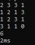
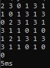

# Dynamic Programming : Another Path Finding Case

## Latar Belakang
*Path Finding* adalah masalah yang berfokus untuk mencari langkah paling optimum untuk bergerak dari posisi asal ke posisi akhir dengan batasan-batasan (*constraints*) tertentu. Masalah ini dapat diselesaikan dengan mudah menggunakan pendekatan strategi algoritma *dynamic programming* seperti pada contoh berikut oleh  [GeeksForGeeks](https://www.geeksforgeeks.org/min-cost-path-dp-6/). Banyak penerapan yang memiliki fokus berbeda terkait topik *Path Finding* seperti pada robot, game, image processing serta pengelolahan efisien industri. Semua kasus ini berkutat dalam mengoptimasi dari sisi paling pendek, paling murah, paling cepat dan parameter lainnya. 

Pada tugas kali ini, anda akan bertugas untuk memodifikasi algoritma *path finding* agar sesuai dengan kebutuhan soal. Diharapkan melalui tugas ini, anda dapat lebih memahami penerapan strategi *dynamic programming* yang sering digunakan dalam dunia IT terkhusus filosofi cara berpikir penyelesaian masalah terkait *path finding*. Selamat mengerjakan!

## Kasus Path Finding
Berikut adalah deskripsi kondisi persoalan yang akan diselesaikan.
1. Terdapat sebuah papan catur *N x N* dengan setiap kotaknya berisi bilangan non negatif.
2. Di awal, suatu bidak berada kotak (1, 1) atau yang di pojok kiri atas.
3. Berikutnya secara berulang bidak dapat dipindahkan (1) horizontal ke kanan, atau (2) vertikal ke bawah sekian kotak sebanyak dengan bilangan pada kotak terakhir bidak itu berada, kecuali kalau membawa bidak keluar dari papan.
4. Tujuan akhir adalah kotak (N, N) atau yang pojok kanan bawah.
5. Bila bilangan terakhir adalah 0 dan bukan di pojok maka bidak berhenti (tidak dapat melanjutkan langkah kecuali kalau sudah mencapai tujuan).

## Dasar Teori
Pemrograman Dinamik (<i>Dynamic Programming</i>) yang biasa disebut DP merupakan suatu metode memecah persoalan kompleks menjadi kumpulan sub-persoalan, lalu hasil <i>solve</i> dari setiap sub-persoalan pada setiap tahapan disimpan pada suatu array, yang pada akhirnya akan dievaluasi untuk mendapatkan nilai paling optimum.

## Langkah-langkah Path Finding
<h3><b>Dynamic Programming: Penggunaan <i>Memoization</i> dengan pendekatan <i>Bottom Up</i></b></h3>
1. Membuat <i><b>matrix of boolean</b></i> yang berisikan <b>True</b> apabila dari poin itu, dapat melakukan gerakan ke poin (N,N). 
2. Untuk mencari path dari suatu poin ke poin lainnya, digunakan algoritma DFS. 
3. Dari matrix of boolean yang sudah dibuat di atas, dihitung total path yang mungkin terjadi dari titik mulai hingga titik akhir. 
4. Total path yang mungkin terjadi dicek secara rekursif, ,<b>terbagi menjadi 3 kasus besar</b>. 
    - Apabila sampai ke titik akhir, return 1. 
    - Apabila sampai ke titik yang bernilai False, return 0. 
    - Apabila tidak sampai titik akhir, namun bernilai True, return jumlah semua path yang bisa dilakukan dari titik tersebut menuju ke titik akhir. 

## Screenshot Contoh Kasus Uji
Program dijalankan dan dites pada laptop dengan spesifikasi: 
<table>
    <tr>
        <td>CPU</td><td>Intel Core i5 5200U @ 2.20 GHz</td>
    </tr><tr>
        <td>GPU</td><td>NVIDIA GeForce 940M</td>
    </tr><tr>
        <td>RAM</td><td>8 GB</td>
    </tr><tr>
        <td>OS</td><td>Windows 10, 64-bit</td>
    </tr>
</table> 
Berikut adalah screenshot dari 2 testcase yang ada pada spesifikasi soal: 
TC1: 
 
TC2: 
 

Dibuat oleh: 
<table border = 1>
    <tr>
        <td>Nama</td><td>Leonardo</td>
    </tr><tr>
        <td>NIM</td><td>13517048</td>
    </tr>
</table>