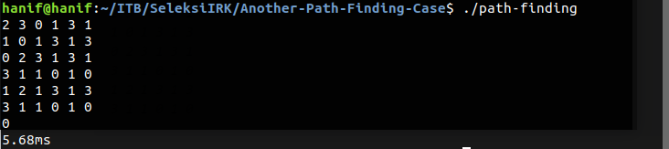
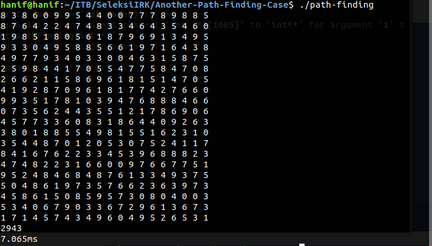

# Dynamic Programming : Another Path Finding Case

## Path Finding
Path finding dalam permasalahan kali ini ialah mencari suatu jalan dari petak 1,1 menuju petak N,N dengan catatan disetiap langkahnya hanya boleh berjalan kekanan atau kebawah sebanyak jumlah angka di petak yang terakhir ditempati.

## Dynamic Programming
Permasalahan path finding ini dapat diselesaikan dengan Dynamic Programming (DP). DP adalah teknik pemecahan masalah dengan memecah perseolan besar menjadi persoalan yang lebih kecil sehingga perseolan yang besar dapat diselesaikan. Kebanyakan program DP bisa juga diselesaikan dengan cara rekursif. DP ini dianggap sebagai teknik efesiensi waktu dari teknik pemecahan masalah secara rekursif karena dengan DP dapat memoisasi hasil pencarian dari STEP yang sudah dijalankan sehingga tidak perlu dicari kembali. 

### Ide Dynamic Programming

Persoalan Dynamic Programming pada petak i,j dinotasikan sebagai f(i,j). Setiap f(i,j) pada rekursif mencari banyaknya macam cara yang dapat ditempuh dari petak (i,j) menuju petak (N,N). Dengan basis pada f(N,N) secara trivia kita bisa tahu bahwa banyaknya cara dari petak (N,N) menuju petak (N,N) adalah 1. Selain itu kita harus menghitung jumlah macam cara dari semua petak yang dapat dijadikan petak selanjutnya. Ini bisa dilakukan dengan cara rekursif.

Secara matematika bisa dinotasikan sebagai berikut :

untuk i = N-1 dan j = N-1, f(i,j) = 1 																		---Basis  
untuk i >= N atau j > N,   f(i,j) = 0																		---Basis  
selain itu, 		       f(i,j) =  												---Rekursif  

## Keterangan
1. Gerak ke kanan ditandai dengan nilai i yang bertambah, sedangkan gerak kebawah ditandakan dengan nilai j yang bertambah

## Spesifikasi Mesin

Processor : Intel Core I5-6200U  
RAM : 4 GB  
Sistem Operasi : Ubuntu 18.04  

## Cara Menjalankan 
Compile : g++ path-finding.cpp -o path-finding  
Run : ./path-finding  
Ingat ketika sudah selesai memasukkan matriks, tekan ctrl+d untuk menghentikan program  

## Contoh Inputan / Keluaran

### Inputan 1

2 3 3 1  
1 2 1 3  
1 2 3 1  
3 1 1 0  

### Keluaran 1
6  
5.696ms  

### Screenshot 1

  
### Masukan 2
2 3 0 1 3 1  
1 0 1 3 1 3  
0 2 3 1 3 1  
3 1 1 0 1 0  
1 2 1 3 1 3  
3 1 1 0 1 0  

### Keluaran 2
0  
5.68ms  

### Screenshot 2

  

### Masukan 3
2 4 5 5 9 6  
3 9 5 1 3 4  
1 8 4 0 1 6  
5 6 3 3 5 8  
8 2 9 2 7 1  
0 8 9 2 3 5  

### Keluaran 3
2  
6.508ms  

### Screenshot 3

  

### Masukan 4
8 3 8 6 0 9 9 5 4 4 0 0 7 7 7 8 9 8 8 5  
8 7 6 4 2 2 4 7 4 8 3 3 4 6 4 3 5 4 6 0  
1 9 8 5 1 8 0 5 6 1 8 7 9 6 9 1 3 4 9 5  
9 3 3 0 4 9 5 8 8 5 6 6 1 9 7 1 6 4 3 8  
4 9 7 7 9 3 4 0 3 3 0 0 4 6 3 1 5 8 7 5  
2 5 9 8 4 4 1 7 0 5 5 4 7 7 5 8 4 7 0 8  
2 6 6 2 1 1 5 8 6 9 6 1 8 1 5 1 4 7 0 5  
4 1 9 2 8 7 0 9 6 1 8 1 7 7 4 2 7 6 6 0  
9 9 3 5 1 7 8 1 0 3 9 4 7 6 8 8 8 4 6 6  
0 7 3 5 6 2 4 4 3 5 5 1 2 1 7 8 6 9 0 6  
4 5 7 7 3 3 6 0 8 3 1 8 6 4 4 0 9 2 6 3  
3 8 0 1 8 8 5 5 4 9 8 1 5 5 1 6 2 3 1 0  
3 5 4 4 8 7 0 1 2 0 5 3 0 7 5 2 4 1 1 7  
8 4 1 6 7 6 2 2 3 3 4 5 3 9 6 8 8 8 2 3  
4 7 4 8 2 2 3 1 6 6 0 0 9 7 6 6 7 7 5 1  
9 5 2 4 8 4 6 8 4 8 7 6 1 3 3 4 9 3 7 5  
5 0 4 8 6 1 9 7 3 5 7 6 6 2 3 6 3 9 7 3  
4 5 8 6 1 5 0 8 5 9 5 7 3 0 8 0 4 0 0 3  
5 3 4 0 6 7 9 0 3 3 6 7 2 9 6 1 3 6 7 3  
1 7 1 4 5 7 4 3 4 9 6 0 4 9 5 2 6 5 3 1  

### Keluaran 4
2943
7.065ms

### Screenshot 4

  